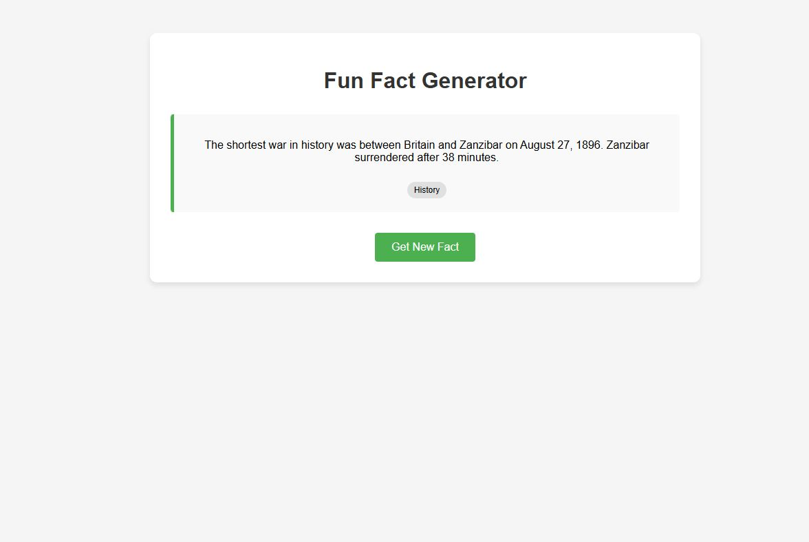

# funfactgenerator

A simple, interactive web application that displays random fun facts at the click of a button. Built with Django as a portfolio project to demonstrate web development skills.



## 📚 About This Project

This Fun Fact Generator is a web application that:

Displays random interesting facts from various categories
Allows users to get a new fact with a single click
Presents facts in a clean, attractive interface
Demonstrates full-stack development with Django

Perfect for learning something new every day or just satisfying your curiosity!

## 🛠️ Tech Stack

* Backend: Django (Python web framework)
* Frontend: HTML, CSS, JavaScript
* Database: SQLite (Django's default database)
* Testing: Django TestCase, Selenium for functional tests

## 🚀 Getting Started

Prerequisites

Python 3.8 or higher
pip (Python package installer)

## Installation

Create a virtual environment

 On Windows
```
python -m venv venv
venv\Scripts\activate
```

 On macOS/Linux
```
python -m venv venv
source venv/bin/activate
```

Install dependencies

`pip install -r requirements.txt`


Run database migrations

`python manage.py migrate`

Load initial fun facts (optional)

`python manage.py load_initial_facts`


Start the development server

`python manage.py runserver`


Visit the application

Open your browser and go to: `http://127.0.0.1:8000/`


## 👩‍💻 Usage

View fun facts: Visit the homepage to see a random fun fact
Get new facts: Click the "Get New Fact" button to display a different fact
Add your own facts: Log in to the admin panel at http://127.0.0.1:8000/admin/ to add, edit, or delete facts

## ✅ Testing

This project includes comprehensive tests to ensure functionality works as expected.

## Running Tests

 Run all tests
`python manage.py test`

## 📂 Project Structure

```funfactgenerator/
├── facts/                  # Main application
│   ├── migrations/         # Database migrations
│   ├── templates/          # HTML templates
│   ├── admin.py            # Admin configuration
│   ├── models.py           # Database models
│   ├── tests.py            # Test cases
│   ├── urls.py             # URL routing
│   └── views.py            # View functions
├── funfactgenerator/       # Project settings
├── manage.py               # Django management script
├── requirements.txt        # Project dependencies
└── README.md               # Project documentation
```

## 🌟 Features

* Random Fact Generation: Get a different fact each time
* Category Support: Facts are organized by categories
* Responsive Design: Looks great on both desktop and mobile
* Admin Interface: Easily manage your fact collection

## 🔮 Future Enhancements

* User accounts to save favorite facts
* Ability to share facts on social media
* Search functionality to find facts by keyword
* API endpoint for developers to access facts

## 📝 Learning Outcomes

Through this project, I demonstrated:

* Building a full-stack web application with Django
* Creating and querying database models
* Implementing AJAX for dynamic content updates
* Writing comprehensive tests for code quality
* Designing a clean, user-friendly interface

📄 License
This project is licensed under the MIT License - see the LICENSE file for details.
